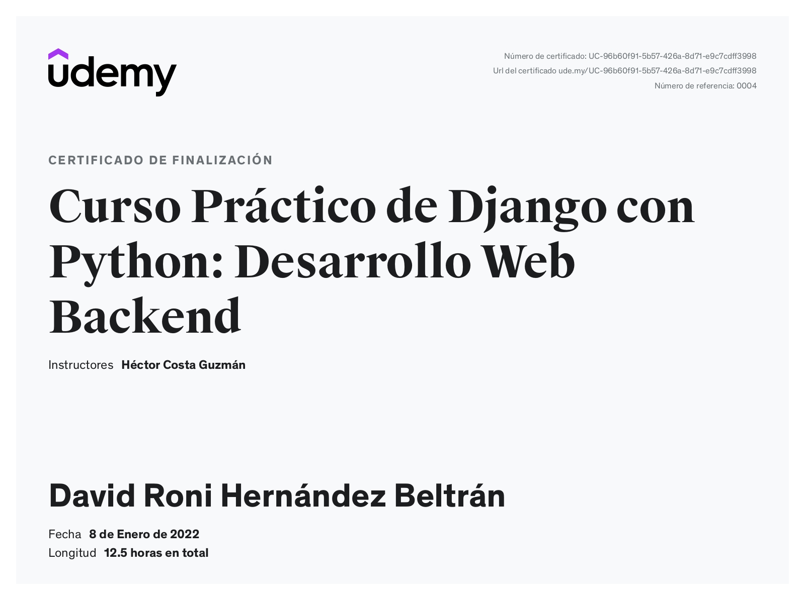

# **Web de cafeteria**
#### **Proyecto desarrollado en el curso de UDEMY cuyo nombre es: Curso Práctico de Django: Desarrollo Web Backend con Python de: Héctor Costa Guzmán Especialista en Python**

A continuación adjunto el certificado que obtuve tras finalizar el grandioso curso de 12.5 horas de video.

## **Menu**

* [1) Descripccion del proyecto](#1-descripccion-del-proyecto)
    * [1.1) Breve visualizacion del proyecto](#11-breve-visualizacion-del-proyecto)
    * [1.2) Conocimientos puestos en practica](#12-conocimientos-puestos-en-practica)

## **1) Descripccion del proyecto**

[Regresar al menu principal](#menu)

Este proyecto es un sitio web de una cafeteria, el cual cuenta con los diferentes apartados:

* Inicio:Basicamente consiste de la presentación de la cafeteria, es el apartado principal es lo primero que veran los usuarios cuando visiten el sitio web.
* Historia:Consiste en un apartado para mostrar la historia de la cafeteria, es decir como inicio y llego a ser lo que es.
* Servicios: Vienen los diferentes descuentos o promociones o servicios que puede llegar a ofrecer la cafeteria.
* Visitanos-. Se muestran los horarios de la cafeteria.
* Contacto-. Permite que el cliente se comunique con el servicio de la cafeteria, a travez de un mensaje.
* Blog-. Vienen las diferentes publicaciones que vaya haciendo la cafeteria y las puede clasificar cada una de ellas en mas de una  categoria

### **1.1) Breve visualizacion del proyecto**

[Regresar al menu principal](#menu)

### **1.2) Conocimientos puestos en practica**

[Regresar al menu principal](#menu)

* Una buena organización de codigo en proyectos de Django
* El uso de diferentes vistas tales como: TemplateView,ListView,DetailView,UpdateView,DeleteView,View
* El uso de  formularios en Django
* La creación de diferentes Apps asi como tambien la creación de modelos.
* El uso de: sqlite como sistema de gestión de bases de datos 
* El uso de: Foundation como framework de interfaz de usuario
* El constante uso del sitio de administración de Django
* La configuración del envio aumatico de correos electronicos con gmail

